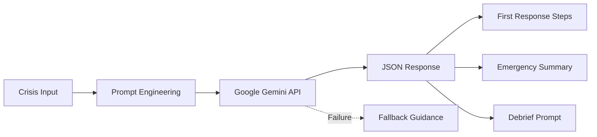
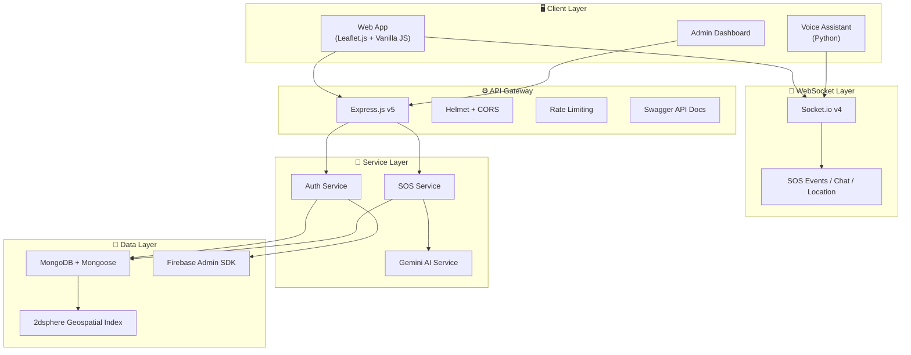
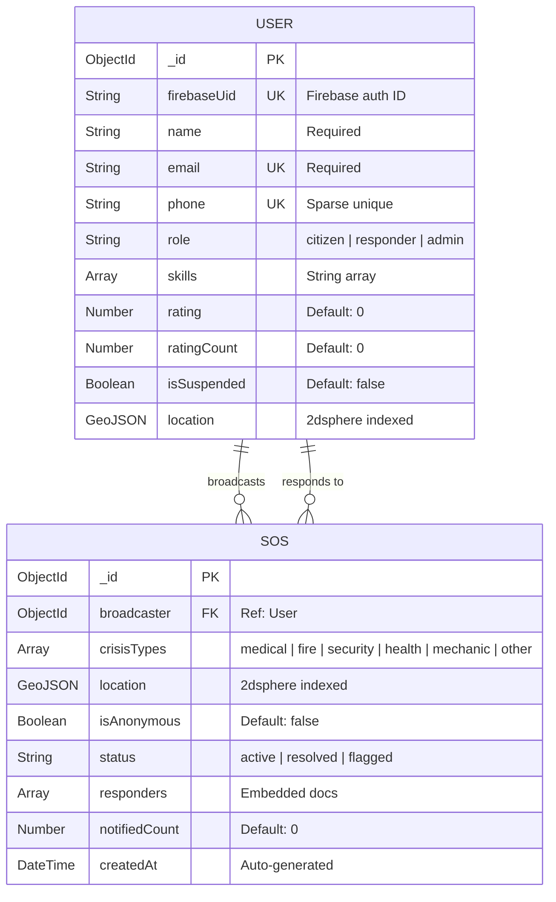
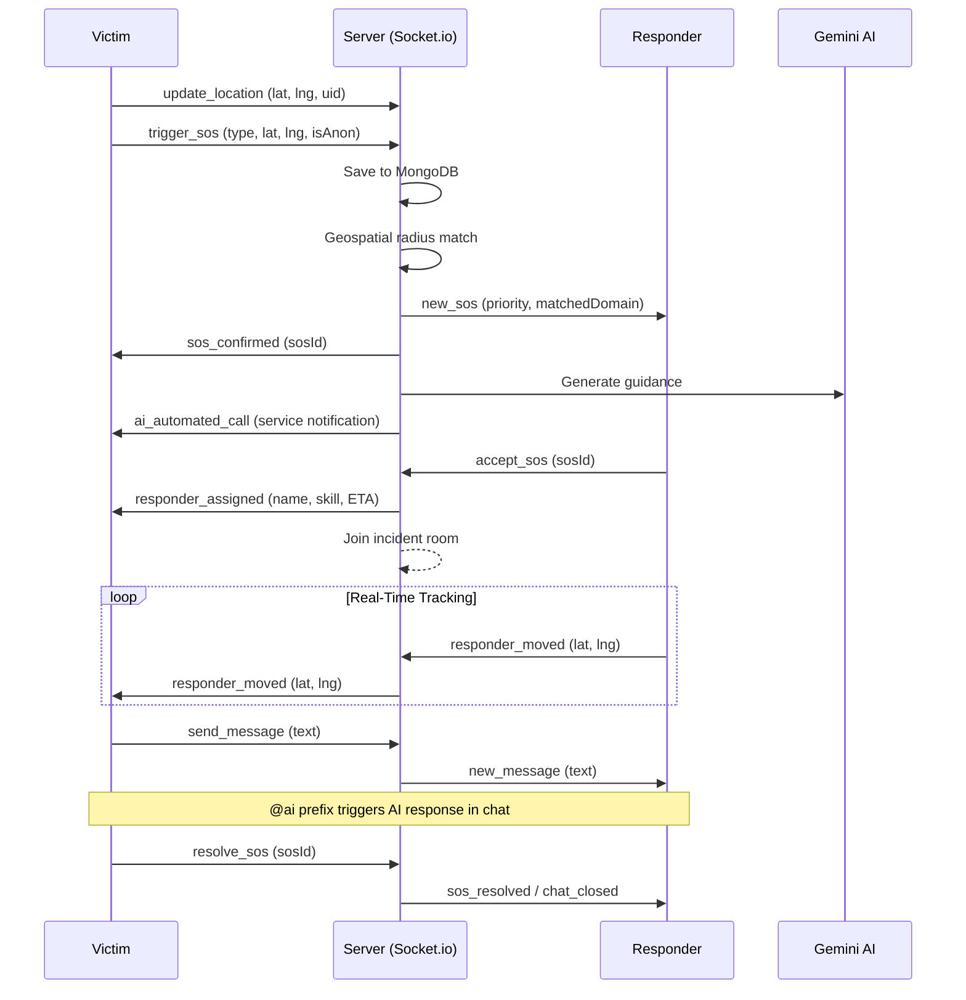
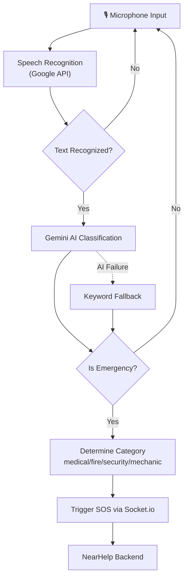
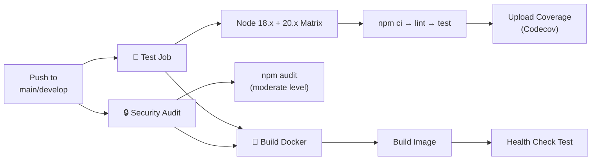
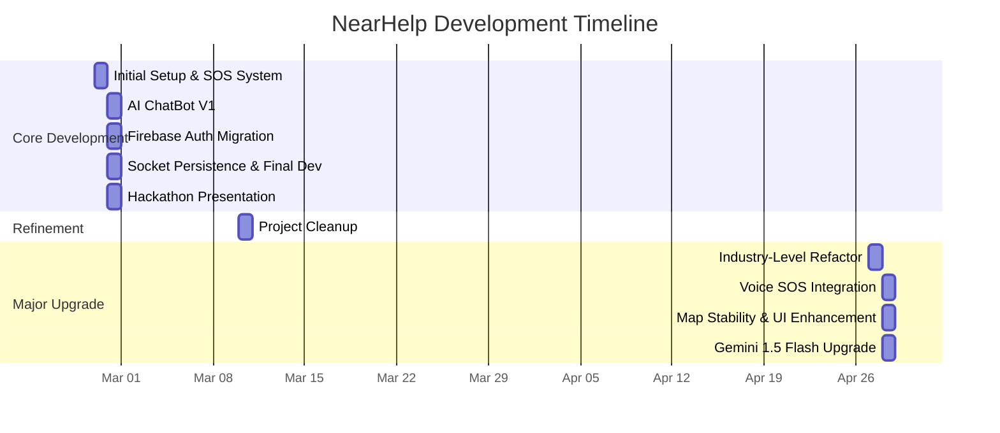

# 📋 NearHelp — Project Report

> **Real-Time Emergency Response Platform**
> Submitted by: **Aritra Saha & Arko Jana**
> Date: May 3, 2026

---

## 1. Executive Summary

**NearHelp** is a full-stack, real-time emergency response platform that connects individuals in crisis with nearby responders using geolocation, AI-powered guidance, and WebSocket communication. The platform enables instant SOS broadcasting, intelligent responder matching based on proximity and skillset, AI-generated crisis guidance via Google Gemini, and a hands-free voice-activated emergency trigger system.

The project was developed as part of the **NIT Jamshedpur — Hack De Science** hackathon and has since been refined into a production-grade application with containerized deployment, CI/CD pipelines, and comprehensive test coverage.

| Attribute | Detail |
|---|---|
| **Project Name** | NearHelp |
| **Repository** | [MR-ARKO-JANA/NIT\_\_HACK\_DE\_SCIENCE](https://github.com/MR-ARKO-JANA/NIT__HACK_DE_SCIENCE) |
| **Production Repo** | [MR-ARKO-JANA/Real-Time-Emergency-Response-Platform](https://github.com/MR-ARKO-JANA/Real-Time-Emergency-Response-Platform) |
| **License** | MIT (Copyright © 2026 Aritra Saha) |
| **Total Commits** | 27 |
| **Development Period** | Feb 27, 2026 — Apr 28, 2026 (~2 months) |
| **Contributors** | Aritra (20 commits), Arko Jana (8 commits) |

---

## 2. Problem Statement

In emergency situations, response time is critical. Traditional emergency services often face delays due to:

- **Geographical distance** from centralized dispatch centers
- **Lack of situational awareness** by first responders before arrival
- **No mechanism** for leveraging nearby skilled individuals (doctors, firefighters, mechanics)
- **Communication gaps** between victims and helpers
- **Accessibility barriers** — victims may not be able to use a phone screen during emergencies

**NearHelp** addresses these challenges by creating a decentralized, community-driven emergency response network that operates in real-time.

---

## 3. Key Features

### 3.1 Core Features

| # | Feature | Description |
|---|---------|-------------|
| 1 | **Real-Time SOS Broadcasting** | Instant emergency alerts with geospatial radius matching using MongoDB 2dsphere indexes |
| 2 | **AI Crisis Assistant** | Google Gemini-powered emergency guidance with structured first-response steps, dispatcher summaries, and debrief prompts |
| 3 | **Live Location Tracking** | Real-time responder tracking on an interactive Leaflet.js map with ETA calculations |
| 4 | **Multi-Crisis Support** | Medical, Fire, Security, Health, and Mechanic emergency types with multi-select capability |
| 5 | **Smart Responder Matching** | Priority-based matching: Domain Specialists (5km radius) > Nearby Helpers (2km radius) |
| 6 | **Anonymous Mode** | Privacy-focused emergency broadcasting for sensitive situations |
| 7 | **Real-Time Chat** | WebSocket-powered incident chat between broadcasters and responders with `@ai` in-chat AI assistant |
| 8 | **Admin Dashboard** | Monitor all active and resolved incidents with real-time updates |
| 9 | **Firebase Authentication** | Secure user authentication with auto-sync to MongoDB |
| 10 | **Voice-Activated SOS** | Hands-free, microphone-based emergency detection using speech recognition + Gemini AI classification |

### 3.2 AI-Powered Capabilities



- **Crisis Guidance**: Generates actionable first-response steps tailored to Indian emergency services (112, 108, 100, 101)
- **Conversational Chat**: Full chatbot capability via `custom_chat` mode using Gemini 1.5 Flash
- **Voice Intent Classification**: On-device emergency classification (Medical/Fire/Security/Mechanic) with keyword fallback
- **Automated Service Notification**: Simulated AI-driven emergency service dispatch

---

## 4. Technology Stack

### 4.1 Architecture Overview



### 4.2 Tech Stack Breakdown

| Layer | Technology | Version | Purpose |
|-------|-----------|---------|---------|
| **Runtime** | Node.js | 18+ | Non-blocking I/O for real-time workloads |
| **Framework** | Express.js | 5.2.1 | RESTful API server |
| **Database** | MongoDB (Mongoose) | 9.2.3 | Geospatial queries, flexible schema |
| **Real-Time** | Socket.io | 4.8.3 | Bidirectional WebSocket communication |
| **Authentication** | Firebase Admin SDK | 13.7.0 | Managed auth with token verification |
| **AI/ML** | Google Gemini (generative-ai) | 0.24.1 | Crisis guidance generation |
| **Maps** | Leaflet.js | — | Interactive map rendering |
| **Logging** | Winston + Morgan | 3.19.0 | Structured application logging |
| **Security** | Helmet, CORS, express-rate-limit | Latest | HTTP security hardening |
| **Validation** | Joi + express-validator | Latest | Input sanitization and validation |
| **API Docs** | Swagger (swagger-jsdoc) | 6.2.8 | OpenAPI 3.0 documentation |
| **Testing** | Jest + Supertest | 30.2.0 | Unit and integration testing |
| **Voice** | Python SpeechRecognition + Gemini | — | Hands-free emergency detection |
| **Containerization** | Docker + Docker Compose | — | Production deployment |

---

## 5. System Architecture

### 5.1 Project Structure

```
NearHelp/
├── 📁 src/                          # Backend source code
│   ├── index.js                     # Server entry point
│   ├── app.js                       # Express app factory
│   ├── 📁 api/
│   │   ├── 📁 controllers/
│   │   │   ├── auth.controller.js   # Authentication handlers
│   │   │   └── sos.controller.js    # SOS + AI guidance handlers
│   │   ├── 📁 routes/
│   │   │   ├── auth.routes.js       # /api/auth/* endpoints
│   │   │   └── sos.routes.js        # /api/sos/* endpoints
│   │   └── 📁 middlewares/
│   │       ├── auth.middleware.js    # Firebase token verification
│   │       ├── errorHandler.middleware.js
│   │       ├── security.middleware.js
│   │       └── validation.middleware.js  # Joi schema validation
│   ├── 📁 config/
│   │   ├── firebase-admin.js        # Firebase Admin initialization
│   │   └── firebase-service-account.json
│   ├── 📁 loaders/
│   │   ├── index.js                 # Loader orchestrator
│   │   ├── express.js               # Express middleware setup
│   │   ├── mongoose.js              # MongoDB connection
│   │   ├── socket.js                # Socket.io initialization
│   │   └── logger.js                # Winston logger config
│   ├── 📁 models/
│   │   ├── user.model.js            # User schema (2dsphere indexed)
│   │   └── sos.model.js             # SOS schema (2dsphere indexed)
│   ├── 📁 services/
│   │   ├── auth.service.js          # User sync, profile CRUD
│   │   └── sos.service.js           # AI guidance, SOS records
│   └── 📁 sockets/
│       └── sos.socket.js            # WebSocket event handlers (260 lines)
├── 📁 public/                       # Frontend (served statically)
│   ├── index.html                   # Main application UI
│   ├── admin.html                   # Admin dashboard
│   ├── authentication.html          # Login/signup page
│   ├── app.js                       # Core frontend logic (964 lines)
│   └── styles.css                   # Full application styles (25KB)
├── 📁 voice-assistant/              # Python voice SOS module
│   ├── voice_sos.py                 # Main voice assistant (175 lines)
│   ├── test_voice_sos.py            # Voice module tests
│   └── requirements.txt             # Python dependencies
├── 📁 __tests__/                    # Jest test suite
│   ├── auth.test.js                 # Auth endpoint tests
│   ├── sos.test.js                  # SOS endpoint tests
│   └── validation.test.js           # Input validation tests
├── 📁 .github/workflows/            # CI/CD pipelines
│   ├── ci.yml                       # Full CI pipeline (test + security + Docker)
│   └── node.js.yml                  # Node.js compatibility matrix
├── Dockerfile                       # Multi-stage production image
├── docker-compose.yml               # Full stack orchestration
├── ARCHITECTURE.md                  # Architecture documentation
├── CONTRIBUTING.md                  # Contribution guidelines
└── LICENSE                          # MIT License
```

### 5.2 Database Schema



### 5.3 WebSocket Event Flow



---

## 6. API Documentation

### 6.1 REST Endpoints

| Method | Endpoint | Auth | Description |
|--------|----------|------|-------------|
| `POST` | `/api/auth/sync` | — | Sync Firebase user to MongoDB |
| `GET` | `/api/auth/profile/:uid` | — | Get user profile by Firebase UID |
| `PUT` | `/api/auth/profile/:uid` | — | Update user profile |
| `POST` | `/api/sos/ai-guidance` | Bearer | Get Gemini-powered crisis guidance |
| `GET` | `/api/sos/alerts` | — | Get all SOS records (Admin) |

### 6.2 WebSocket Events

| Direction | Event | Payload | Description |
|-----------|-------|---------|-------------|
| **Client → Server** | `update_location` | `{lat, lng, uid, name, role}` | Register/update user position |
| | `trigger_sos` | `{type, types[], lat, lng, isAnon}` | Broadcast emergency |
| | `accept_sos` | `{sosId}` | Responder accepts incident |
| | `send_message` | `{sosId, text}` | Send chat message |
| | `responder_moved` | `{sosId, lat, lng}` | GPS tracking update |
| | `resolve_sos` | `{sosId}` | Close active incident |
| **Server → Client** | `sos_confirmed` | `{id, broadcasterId, type, ...}` | SOS saved and active |
| | `new_sos` | `{...sosEvent, priority, matchedDomain}` | New emergency nearby |
| | `responder_assigned` | `{sosId, responder}` | Help is en route |
| | `new_message` | `{sender, text, timestamp}` | Chat message received |
| | `responder_moved` | `{responderId, lat, lng}` | Responder location update |
| | `ai_automated_call` | `{type, number, message}` | AI dispatch notification |
| | `sos_resolved` | `{sosId}` | Incident closed |

### 6.3 Interactive API Documentation

Swagger UI is available at: `http://localhost:3000/api-docs` (OpenAPI 3.0 specification)

---

## 7. Security Architecture

NearHelp implements a **defense-in-depth** security strategy across four layers:

```mermaid
graph LR
    subgraph L1["🌐 Network Layer"]
        CORS["CORS Whitelist"]
        RATE["Rate Limiting<br/>(500 req/15min)"]
        HELM["Helmet Headers"]
    end

    subgraph L2["🔒 Application Layer"]
        VAL["Joi Schema Validation"]
        SAN["NoSQL Injection Prevention"]
        XSS["XSS Protection"]
    end

    subgraph L3["🔑 Authentication Layer"]
        FB["Firebase Token Verify"]
        JWT["JWT Session Mgmt"]
        RBAC["Role-Based Access"]
    end

    subgraph L4["💾 Data Layer"]
        MONGOOSE["Mongoose Schema Validation"]
        QSAN["Query Sanitization"]
        ENC["Encrypted Connections"]
    end

    L1 --> L2 --> L3 --> L4
```



| Security Measure | Implementation |
|---|---|
| **Helmet.js** | Security headers (CSP disabled for dev flexibility) |
| **CORS** | Whitelist with localhost fallback support |
| **Rate Limiting** | 500 requests per 15-minute window on `/api/*` |
| **Input Validation** | Joi schemas + express-validator |
| **NoSQL Injection** | express-mongo-sanitize |
| **Authentication** | Firebase Admin SDK token verification |
| **In-Memory Fallback** | Offline prototype mode when MongoDB is unavailable |

---

## 8. Voice-Activated SOS System

The voice assistant is a standalone Python module that provides **hands-free emergency detection**:



| Feature | Detail |
|---------|--------|
| **Wake Detection** | Continuous microphone listening with 3s timeout |
| **AI Classification** | Gemini 2.0 Flash for intent recognition |
| **Keyword Fallback** | 18 emergency keywords + 12 trigger phrases |
| **Hindi Support** | Keywords: "bachao", "madad", "police ko bulao", "khatra" |
| **Location** | IP-based geolocation with Jamshedpur fallback coordinates |
| **Connection** | Socket.io client with auto-reconnect |

---

## 9. Smart Responder Matching Algorithm

The system implements a **two-tier priority-based matching** algorithm:

```
For each connected user (excluding broadcaster):
  1. Calculate Haversine distance
  2. Check skill match against crisis types

  PRIORITY 1 — Domain Specialist (5km radius):
    • medical/health → doctor, medical, nurse
    • fire           → firefighter
    • security/police → security, police
    • mechanic       → mechanic

  PRIORITY 2 — Nearby Helper (2km radius):
    • volunteer, neighbour, citizen, or unspecified role

  Sort by: Priority ASC → Distance ASC
  Notify each matched responder via targeted Socket.io emit
```

This ensures that **skilled responders within a wider radius** are prioritized over **general helpers who are closer**, optimizing for both expertise and proximity.

---

## 10. Testing & Quality Assurance

### 10.1 Test Suite

| Test File | Coverage Area | Key Tests |
|-----------|--------------|-----------|
| `auth.test.js` | Authentication endpoints | User sync, profile retrieval, validation |
| `sos.test.js` | SOS endpoints | AI guidance, alert records, error handling |
| `validation.test.js` | Input validation | Schema enforcement, edge cases, malformed input |
| `test_voice_sos.py` | Voice assistant | Emergency detection, classification accuracy |

### 10.2 Test Configuration

```
Framework:        Jest v30.2.0 + Supertest v7.2.2
Environment:      Node (mongodb-memory-server for isolation)
Coverage Target:  70% branches, functions, lines, statements
Timeout:          10,000ms per test
```

### 10.3 CI/CD Pipeline



**Pipeline Stages:**
1. **Test** — Runs on Node.js 18.x and 20.x, executes full test suite with coverage
2. **Security Audit** — `npm audit` at moderate severity level
3. **Docker Build** — Builds production image and validates with health check endpoint

---

## 11. Deployment

### 11.1 Docker Configuration

**Dockerfile** — Multi-stage Alpine-based production image:
```
Base:       node:18-alpine
Strategy:   npm ci --only=production
Port:       8080 (Cloud Run compatible)
Env:        NODE_ENV=production
```

**Docker Compose** — Full-stack orchestration:
```
Services:
  ├── mongodb (mongo:7) — Port 27017, persistent volume
  └── app (custom build) — Port 3000, depends on mongodb
Network:    nearhelp-network (bridge)
Volumes:    mongodb_data (local driver)
```

### 11.2 Deployment Targets

| Platform | Status | Notes |
|----------|--------|-------|
| **Local Development** | ✅ Active | `npm run dev` (nodemon) |
| **Docker Compose** | ✅ Ready | `docker-compose up -d` |
| **Google Cloud Run** | ✅ Configured | Dockerfile ready, PORT env injection |
| **MongoDB Atlas** | ✅ Compatible | Connection string via MONGO_URI |

### 11.3 Environment Variables

| Variable | Required | Description |
|----------|----------|-------------|
| `PORT` | No (default: 3000) | Server listening port |
| `NODE_ENV` | No | Environment flag |
| `MONGO_URI` | Yes | MongoDB connection string |
| `GEMINI_API_KEY` | Yes | Google Gemini API key |
| `ALLOWED_ORIGINS` | No | CORS whitelist |
| `CLIENT_URL` | No | Frontend origin URL |
| `FIREBASE_PROJECT_ID` | Yes | Firebase project identifier |
| `FIREBASE_CLIENT_EMAIL` | Yes | Service account email |
| `FIREBASE_PRIVATE_KEY` | Yes | Service account private key |

---

## 12. Development Timeline



| Phase | Date | Milestone |
|-------|------|-----------|
| **Sprint 1** | Feb 27 | Initial project setup, Trigger SOS system |
| **Sprint 2** | Feb 28 | AI ChatBot V1, Firebase migration, socket fixes, hackathon submission |
| **Refinement** | Mar 10 | Project cleanup and code quality improvements |
| **Sprint 3** | Apr 27 | Industry-level refactor: layered architecture, Swagger docs, security hardening |
| **Sprint 4** | Apr 28 | Voice SOS integration, Gemini 1.5 Flash upgrade, satellite map UI, resilient loading |

---

## 13. Key Design Decisions

| Decision | Rationale |
|----------|-----------|
| **MongoDB over PostgreSQL** | Native geospatial queries (2dsphere), flexible schema for evolving crisis types |
| **Socket.io over raw WebSocket** | Automatic reconnection, room-based broadcasting, transport fallbacks |
| **Firebase Auth over custom JWT** | Managed authentication reduces security surface area, easy integration |
| **Gemini AI over OpenAI** | Free tier availability, good response quality for emergency guidance |
| **Vanilla JS frontend** | Zero build step, fast iteration during hackathon, direct DOM control |
| **In-memory fallback** | Ensures app functions even when MongoDB is unavailable (offline/demo mode) |
| **Python voice module** | Leverages mature speech recognition libraries (SpeechRecognition, Google API) |
| **Layered architecture** | Loaders → Routes → Controllers → Services → Models for maintainability |

---

## 14. Performance Characteristics

| Metric | Implementation |
|--------|---------------|
| **Geospatial Queries** | MongoDB 2dsphere indexes on User.location and SOS.location |
| **Real-Time Latency** | Socket.io room-based targeted broadcasts (not global) |
| **AI Response** | Gemini 1.5 Flash (low-latency model) with hardcoded fallback |
| **Location Updates** | 10-second polling interval for periodic location sync |
| **Rate Limiting** | 500 requests per 15-minute window per IP |
| **Connection Management** | In-memory Maps for active SOS and connected users |
| **Map Tiles** | Google Hybrid satellite view with CartoDB fallback |

---

## 15. Future Enhancements

| Priority | Enhancement | Description |
|----------|-------------|-------------|
| 🔴 High | **React Native Mobile App** | Native mobile experience with background services |
| 🔴 High | **Push Notifications (FCM)** | Firebase Cloud Messaging for offline alert delivery |
| 🟡 Medium | **WebRTC Video Calls** | Direct video communication between victim and responder |
| 🟡 Medium | **Service Workers** | Offline mode and progressive web app capabilities |
| 🟡 Medium | **Redis Adapter** | Horizontal scaling for Socket.io across multiple instances |
| 🟢 Low | **Analytics Dashboard** | Incident analytics, response time metrics, heatmaps |
| 🟢 Low | **ML Incident Prediction** | Pattern-based prediction of high-risk areas and times |
| 🟢 Low | **MongoDB Replica Set** | Database high availability and read scaling |

---

## 16. Conclusion

NearHelp demonstrates a complete, production-viable emergency response platform built with modern web technologies. The system successfully integrates:

- **Real-time communication** via WebSockets for instant SOS broadcasting and responder coordination
- **AI-powered intelligence** using Google Gemini for crisis guidance and voice-based emergency detection
- **Geospatial awareness** through MongoDB's native 2dsphere indexes for proximity-based responder matching
- **Security hardening** with multi-layer defense (Helmet, CORS, rate limiting, Firebase auth, input validation)
- **Cloud-native deployment** via Docker containerization and Google Cloud Run compatibility
- **Automated quality gates** through GitHub Actions CI/CD with test matrix and security audits

The platform is architected for future scalability through a clear separation of concerns (loaders, routes, controllers, services, models) and can evolve into a microservices architecture as the user base grows.

---

> *"Built for emergency response and community safety"*
> 
> **NearHelp** — When seconds matter, your neighbours are your first responders.
